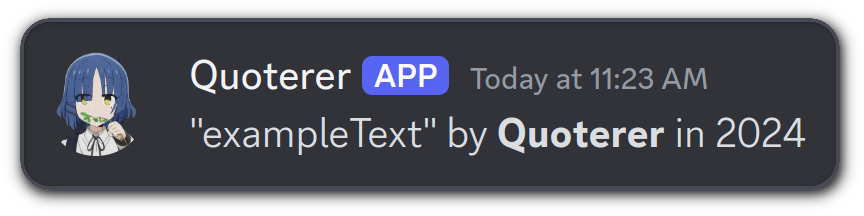

<div align="center">
  <picture>
    <source
        media="(prefers-color-scheme: dark)"
        srcset="./assets/title_dark.png"
    />
    <source
        media="(prefers-color-scheme: light), (prefers-color-scheme: no-preference)"
        srcset="./assets/title_light.png"
    />
    
  </picture>
  <br>
  
  &nbsp;
  
  &nbsp;
  
  &nbsp;
  
</div>
A Discord bot which sends quotes into designated channels, collects and stores them in a MongoDB database. A website is in development which displays the quotes in real-time. Future updates may include voting and commenting functionalities for the website.

## Prerequisites

- git
- docker & docker compose
- npm

## Build
- Clone the repo
```
git clone git@github.com:Traube1000101/quoterer
```
- Change into the directory
```
cd quoterer
```
- Create a file named `.env`
```
db_user=
db_password=
db_interface_user=
db_interface_password=
bot_id=
bot_token=
namespace_uuid=
```
- Fill in the values. The namespace uuid must be a valid UUIDV4, create one e.g. with an [online generator](https://www.uuidgenerator.net/version4).

## Usage
- ~~Deploy the commands to your discord app~~ There's currently an issue regarding this, commands can't be deployed!
```
(cd bot; npm run deploy)
```  
- Start the app
```
sudo docker compose up -d
```
- The mongo express interface is reachable at
```
localhost:8081
```
## Disclaimer
The bot is made for a specific style of quotes, this cannot be changed from within Discord, feel free to change it in source though.  
### Example:


