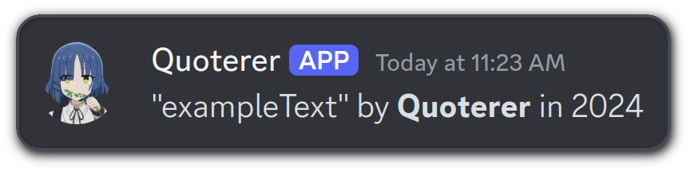

<div align="center">
  <picture>
    <source
        media="(prefers-color-scheme: dark)"
        srcset="./assets/title_dark.png"
    />
    <source
        media="(prefers-color-scheme: light), (prefers-color-scheme: no-preference)"
        srcset="./assets/title_light.png"
    />
    
  </picture>
  <br>
  
  &nbsp;
  
  &nbsp;
  
  &nbsp;
  
</div>

A Discord bot that lets server members capture and archive quotes - single lines or multi-passage conversations - into a designated channel. Everything is persisted through a GraphQL API backed by PostgreSQL, so nothing gets lost in the scroll.

## What it does

- **`/quote`** - Save a single quote, optionally attributed to another user.
- **`/quote-much`** - Build a multi-passage conversation quote one passage at a time, then submit the whole thing.
- **`/quote-private` / `/quote-much-private`** - Same thing, but marked as private (won't show up on external displays like a website).
- **`/set-channel`** - Pick the text channel where quotes get posted. Requires _Manage Server_ permission.
- **`/resend-all-quotes`** - Re-post every stored quote to the quotes channel, with options to wipe old messages first and include/exclude private quotes. Requires _Manage Channels_ permission.
- **`/ping`** - The classic.

Every quote goes through a confirm/cancel prompt before being saved, so no accidental submissions. Quotes are formatted with the quoted text, author mentions, date, and who archived them.

## Architecture

The whole stack runs via **Docker Compose** with three services on a shared bridge network:

| Service    | What it is                                                                                                                                                                 |
| ---------- | -------------------------------------------------------------------------------------------------------------------------------------------------------------------------- |
| `bot`      | This repo - the Discord bot. Built with a multi-stage Dockerfile using `node:lts-alpine`.                                                                                  |
| `api`      | [quoterer-api](https://git.zetacron.de/tyrem-envalura/quoterer-api) - a Spring-based GraphQL API, built from its own git repo at compose build time. Exposed on port 8080. |
| `postgres` | Plain PostgreSQL instance with a persistent volume for data storage.                                                                                                       |

The bot talks to the API over the internal Docker network at `http://api:8080/graphql`. The API handles all persistence - the bot itself is stateless (aside from in-memory sessions for multi-passage quotes).

GraphiQL is enabled on the API, so you can poke around at [localhost:8080/graphiql](http://localhost:8080/graphiql) when the stack is running.

## Prerequisites

- Git
- Docker & Docker Compose
- Node.js ≥ 22
- pnpm (or npm/yarn, but the scripts are tested with pnpm)

## Setup

Clone the repo and install dependencies:

```sh
git clone git@zetacron.de:tyrem-envalura/quoterer.git
cd quoterer
pnpm install
```

Create a `.env` file in the project root with the following variables:

```
# Discord bot environment variables
DISCORD_CLIENT_ID=
DISCORD_TOKEN=
MAX_RESPONSE_TIME=60000

# Credentials for the PostgreSQL database, shared between the API and the database container.
POSTGRES_USER=
POSTGRES_PASSWORD=
POSTGRES_DB=

# (Optional) Default guild ID for deploying slash commands
DEV_GUILD_ID=
```

- `DISCORD_CLIENT_ID` / `DISCORD_TOKEN` - From the [Discord Developer Portal](https://discord.com/developers/applications).
- `MAX_RESPONSE_TIME` - How long (in milliseconds) the bot waits for a user to confirm or cancel a quote before timing out.

## Scripts

| Script                           | What it does                                                                                              |
| -------------------------------- | --------------------------------------------------------------------------------------------------------- |
| `pnpm run dev`                   | Bundles and runs the bot directly via esbuild - no output file, just pipes to node. Handy for local dev.  |
| `pnpm run start`                 | Runs the pre-built `dist/index.cjs`.                                                                      |
| `pnpm run build:commands`        | Regenerates `src/commands/index.ts` by scanning command files in `src/commands/`.                         |
| `pnpm run build:production`      | Produces a minified production bundle at `dist/index.cjs`.                                                |
| `pnpm run build`                 | Runs `build:commands` and then `build:production`.                                                        |
| `pnpm run register:dev`          | Rebuilds command index, then deploys slash commands to your dev guild (`scripts/deploy-commands-dev.ts`). |
| `pnpm run register:global`       | Rebuilds command index, then deploys slash commands globally (`scripts/deploy-commands-global.ts`).       |
| `pnpm run register:global:clear` | Clears all globally registered slash commands (`scripts/deploy-commands-global-clear.ts`).                |
| `pnpm run check:style`           | Runs Prettier in check mode.                                                                              |
| `pnpm run check:lint`            | Runs ESLint across the project.                                                                           |
| `pnpm run check:types`           | Runs TypeScript type-checking without emitting files.                                                     |
| `pnpm run check`                 | Runs style, lint, and type-checking in sequence.                                                          |
| `pnpm run format`                | Auto-fixes lint issues and formats everything with Prettier.                                              |

## Running (for development)

(Re-) build the bot:

```sh
docker compose build bot
```

Fire up the whole stack:

```sh
docker compose up -d
```

This builds the bot and API containers, starts PostgreSQL, and wires everything together. The bot will log in and can then be registered with `register:dev` (guild-scoped for fast development) or `register:global`.

For local development without Docker, make sure the API and database are accessible and the `QUOTERER_GRAPHQL_ENDPOINT` environment variable points to the right URL, then:

```sh
pnpm run dev
```

## Disclaimer

The bot uses a specific quote style - you can't change the formatting from within Discord. Feel free to tweak `src/util/discord-formatting.ts` if you want a different look.

### Example:


